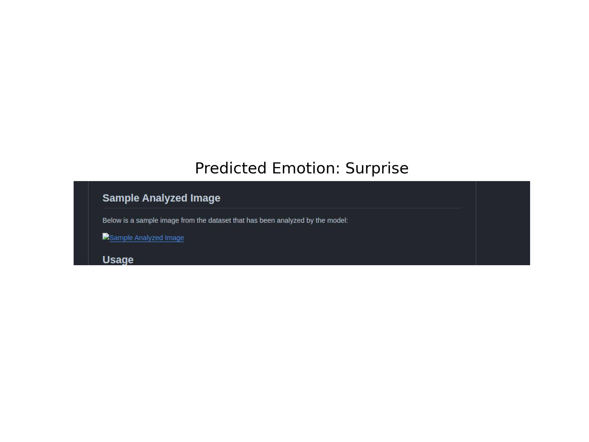

# human-emotions-capturing
Building a model to capture human emotional swings based on their mood.

## Workflow

1. **Data Loading and Preprocessing**:
   - Load the dataset containing categorized emotion images.
   - Preprocess the images by resizing and normalizing them.
   - One-hot encode the labels for the emotion categories.

2. **Model Building**:
   - Build a Convolutional Neural Network (CNN) using TensorFlow.
   - Define the architecture with convolutional, pooling, and dense layers.

3. **Model Training**:
   - Train the model using the preprocessed dataset.
   - Monitor training and validation accuracy and loss.

4. **Performance Evaluation**:
   - Evaluate the model's performance on the validation set.
   - Save the training history for visualization.

5. **Visualization**:
   - Generate plots for training and validation accuracy and loss.
   - Save the plots as images for analysis.

## Sample Analyzed Image

Below is a sample image from the dataset that has been analyzed by the model:



## Usage

1. Clone the repository:
   ```bash
   git clone https://github.com/VishwamAI/human-emotions-capturing.git
   cd human-emotions-capturing
   ```

2. Install the required dependencies:
   ```bash
   pip install -r requirements.txt
   ```

3. Run the emotion recognition model script:
   ```bash
   python emotion_recognition_model.py
   ```

4. Generate training performance visualizations:
   ```bash
   python generate_plots.py
   ```

## Contributing

Feel free to open issues or submit pull requests for any improvements or bug fixes.

## License

This project is licensed under the MIT License.
